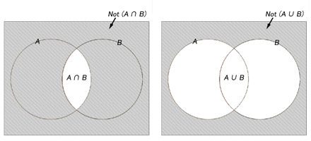

# chapter 04. 制御構文

**構造化プログラミング**：順序/選択/反復を君合わせながらプログラムを組み立てていくこと  

一般的なプログラムの構造は以下となる。
* 順序 (順接)：記述された順位処理を実行
* 選択：条件によって処理を分散
* 反復：特定の処理を繰り返し実行


## 4.1. 条件分岐
### *4.1.1. if 命令 - 単純分岐*
* 構文 =「if...elif...else」
* if = 与えられた条件が True/False であるかによって実行すべき処理を決める命令
  * 「もしも〜だったら...、さもなくば...」

構文例
```
if 条件式：
    ... 条件式が True の時に実行する処理...
else:
    ... 条件式が False の時に実行する処理...
```


### **[ 文法的なキーワード ]**
1. 複合文 (compound Statement)：配下に複数の文を持ち、それらの文を実行するかどうかを決めるための文  
if、for、while などの制御構文は全て複合文である。  
1 つ以上の説 (clause) から構成されるもの。節は、ヘッダー (header) とスイート (suite) に分類される。

if_basic01.py
```py
i = 10

# 節 1.
if i == 10:   　 # ヘッダー
    print('変数 i は 10 です。')           # スイート

# 節 2.
else:            # ヘッダー
    print('変数 i は 10 ではありません。')　 # スイート
```

2. ヘッダーは制御ルールを表す  
配下のブロックをどのように実行するのか (そもそも実行するのか) を決める情報を表す。  
if 節の場合、条件式が True の時、配下のブロックを実行し、else 節は False の時実行する。  
* 1 つの複合文でヘッダーのインデント (字下げ) いちは揃っていること  
* ヘッダーを識別するキーワード (ここでは if) で始まり、コロン (:) で終わっていること

```py
if i == 10:   　 
    print('a')          
else:           
    print('b')　 


# if と else のヘッダーの開始位置が揃っていること
# 各ヘッダーはコロン (:) で終わっていること
```

3. インデントでブロックを表す   
Python の場合、インデント (字下げ) でブロックを表す。  
インデントは、半角空白/Tab で表せる。

```py
if i = 10:
    print('a')
    print('b')
else:
...

# print('a') と print('b') は同じブロックである
# ブロックの前は、半角空白 4 個が基本
# else: = ブロック終了
```


**[ インデントの注意点 ]**
1. からのブロックは pass 命令で表す  
Python はヘッダの直後にブロックを期待しているので、エラーとなることがある。  
そのため、 pass 命令文を指定しないといけない。

if_basic02.py
```py
# if i == 10:
    #  空のブロック、のつもり → これではエラーが出る。

i = 10

if i == 10:
    pass
```

2. 複数行コメントもインデントする  
複数行コメントはあくまで文字列リテラルであるため

multicomment_indent.py
```py
# if i == 10:
# '''
# コメント
# '''
#   print('変数 i は 10 です')
## 上記の場合はコメントもインデントの対象なのでエラーが発生する。

i = 10

if i == 10:
    '''
    コメント
    '''
    print('変数 i は 10 です')
```

実行結果
```
$ python3 multicomment_indent.py

変数 i は 10 です
```

しかし、単一行コメントは真正のコメント構文であるため (= 文ではない) インデントを無視しても大丈夫

singlecomment_indent.py
```py
i = 10

if i == 10:
# コメント
    print('変数 i は 10 です。')
```

実行結果
```
$ python3 singlecomment_indent.py 

変数 i は 10 です。
```


### *4.1.2. if 命令 - 多岐分岐*
* elif ブロック = 「もしも〜だったら...、〜であれば...、いずれでもなければ...」
* elif は分岐の数だけ列記できる。

構文例
```
if 条件式 1:
    ...条件式 1 が True の時、実行する処理...
elif 条件式 2:
    ...条件式 2 が True の時、実行する処理...
...
else:
    ...条件式 1、2 がいずれかも False の時、実行する処理...
```


if_else01.py
```py
i = 100

if i > 50:
    print('変数 i は 50 より大きい')
elif i > 30:
    print('変数 i は 30 より大きい')
else:
    print('変数 i は 30 以下')
```

実行結果
```
$ python3 if_else01.py

変数 i は 50 より大きい
```

→ 複数の条件に合致している場合でも、最初の条件に合致したブロックだけが実行される。  
→ if_else01.py の場合、i は 50 より大きいし 30 より大きいが、最初の条件が「i > 50」なので、結果は「変数 i は 50 より大きい」と出力される


### **[ switch 命令 ]**
* Python では switch 命令はない
* if...elif 命令で代替できる

switch.py
```py
rank = 'A'

if rank == 'A':
    print('大変良い')
elif rank == 'B':
    print('良い')
elif rank == 'C':
    print('がんばりましょう')
else:
    print('?')
```

実行結果
```
$ python3 switch.py 

大変良い
```

メモ
```py
# rank = ‘A’
import random
rank = random.choice(['A', 'B', 'C', 'Hoge'])

if rank == 'A':
    print('大変良い')
elif rank == 'B':
    print('良い')
elif rank == 'C':
    print('がんばりましょう')
else:
    print('?') 
```

実行結果
```
$ python3 switch.py
大変良い

$ python3 switch.py
良い
```
→ random.choice で 'A' と 'B' と 'C' と 'Hoge' をランダムで選ぶように実装されてる


### *4.1.3. if 命令 - 入れ子構造*
* ネスト = if 文の条件分岐処理の中にさらに条件分岐を行うこと

if_nest01.py
```py
i = 1
j = 0

if i == 1:
    if j == 1:
        print('変数 i、j は 1')
    else:
        print('変数 i は 1 だが、j は 1 ではない')
else:
    print('変数 i は 1 ではない')
```

実行結果
```
$ python3 if_nest01.py 

変数 i は 1 だが、j は 1 ではない
```

1. 変数 i は 1 かどうか (i == 1)。Yes/No  
No である場合 → 「変数 i は 1 ではない」  
Yes である場合

2. 変数 j は 1 かどうか (j == 1)。Yes/No  
No である場合 → 「変数 i は 1 だが、j は 1 ではない」  
Yes である場合 → 「変数 i、j は 1」  

ネスト構造の場合、ブロックをどこで終えるかによってどこまでインデントを戻すかに注意する

構造 #1
```py
if 条件_1:
    ...コード_1...

    if 条件_2:
        ...コード_2...
    ...コード_3...
```
→ コード_3 は、条件_2 の中で実行される

構造 #2
```py
if 条件_1:
    ...コード_1...

    if 条件_2:
        ...コード_2...
...コード_3...
```
→ コード_3 は、条件_1 の中で実行される


### *4.1.4. 条件式を指定する場合の注意点*
1. 条件式を丸カッコでくくる場合  
全体を丸カッコでくくる事により、複雑な条件式を改行できる

```py
if (a == 100
and b == 200
and c == 300):
    ~
```

2. bool 型の変数を「==」で比較しない  
* True/False を表す時は、「==」で表示する必要はない (例：flag == True → if flag:)
* 以下の値は False をみなす (これ以外の値は True となる)
    * None
    * ゼロ値 (0、0.0、0j、Decimal(0)、Fraction(0,1))
    * 空の文字列 (")
    * 空のコレクション (()、[]、{}、set()、range(0)...)

```py
flag = True

if flag:
    ~
```

3. 条件式からはできるだけ否定を取り除く  
* 否定 + 論理演算子の組み合わせは混乱するので、基本的に肯定表現にしてあげるのがいい
* ド・モルガンの法則を使う

ド・モルガンの法則
```
not A and not B ←→ not(A or B)
not A or not B ←→ not (A and B)
```



x 例
```py
if not flag_1 and not flag_2:
    ~

# flag_1 も flag_2 も True でない時 〜
```

◯ 例
```py
if not(flag_1 or flag_2):
    ~
```


## 4.2. 繰り返し処理
* 繰り返し処理 = 反復
* Python では、 while/for を使う


### *4.2.1. 条件式が True の間だけ処理を繰り返す - while 命令*
条件式が True の間のみ処理を繰り返し実行する

構文例
```py
while 条件式:
    ...joukennsikiga True である間、繰り返し実行する処理...
```

例：変数 i の値が「1 ~ 5」で変化している間、処理を繰り返し実行する。  
→ i が 6 以上になったところで while ループは終了する。  
while_basic.py
```py
i = 0

while i < 6:
    print(i, '番目のループ')
    i += 1
```

実行結果
```
$ python3 while_basic.py

0 番目のループ
1 番目のループ
2 番目のループ
3 番目のループ
4 番目のループ
5 番目のループ
```


### *4.2.2. 無限ループ*
* 無限ループ = 終了条件が False にならないループのこと

例
```py
i = 0

while i < 6:
    print(i, '番目のループ')
    # i += 1

# i が永遠に 0 なので無限にループし続ける
```


### *4.2.3. リストの内容を順に処理する - for 命令*
* リスト/辞書のような型から全ての値を取り出す時に使う
* 仮変数 = リストから取り出した要素を一時的に格納するための変数
* for 命令で繰り返し処理ができるもの：イテラブル型 (リスト、文字列、ダブル、セット、辞書...)

構文例
```py
for 仮変数 in リスト:
    ...個々の要素を処理するためのコード...
```

例：リストから取り出した要素の値を表示する  
foreach.py 
```py
data1 = ['A','B','C']

for i in data1:
    print(i)


data2 = 'こんにちは'

for i in data2:
    print(i)
```

実行結果
```
$ python3 foreach.py

A
B
C
こ
ん
に
ち
は
```


### 4.2.4. 決められた回数だけ処理を実行する - for 命令 (range 関数)*
* range 関数 = x 以上 y 未満の整数リストを生成する

for_range.py
```py
for i in range(0, 3):
    print(i, '番目')
```

実行結果
```
$ python3 for_range.py 

0 番目
1 番目
2 番目
```


### [ range 関数のさまざまな表現 ]
1. 0 から n までの値を生成
```py
range(0,10)
# 0 以上 10 未満の値を生成
```

2. 値の増分を設定
```py
range(0,10,2)
# 0,2,4,6,8
# 0 以上 10 未満で 2 つ飛ばし

range(5,0,-1)
# 5,4,3,2,1

reversed(range(0,10,3))
# 9,6,3,0
```

3. range をリスト化する
```py
print(range(0,7,2))
# range(0,7,2)
# 定義が表示されてしまう

print(list(range(0,7,2)))
# 0,2,4,6
# list 関数を入れてリスト化する必要がある
```


### *4.2.5. リストから新たなリストを生成する - リスト内包表記
内包表記 (compreension) = 既存のリストから新たなリストを生成する

構文例
```py
式 for 仮変数 in リスト
```

for_list.py
```py
data1 = [15,20,25,30]
data2 = [i * 2 for i in data1]

print(data2)


data3 = [15,20,25,30]
data4 = []

for i in data3:
    data4.append(i * 2)  # append = リストに要素を追加する命令  

print(data4)


data5 = [str(i) for i in data4]  # リストの数値を文字列に変更する
print(data5)
```

実行結果
```
$ python3 for_list.py

[30, 40, 50, 60]
[30, 40, 50, 60]
['30', '40', '50', '60']
```


### [ 特定の値だけを取得する ]
for_list_if.py
```py
data1 = [15,20,25,30,35,40]
data2 = sum([i for i in data1 if i < 30])
# もし i が 50 未満である場合、その対象の値を全て合計する
# 15 + 20 + 25

print(data2)
```

実行結果
```
$ python3 for_list_if.py

60
```


## 4.3. ループの制御
### *4.3.1. ループを中断する - break 命令*
break 命令 = 繰り返し処理を強制終了できる

break.py
```py
sum = 0

for i in range(1,101):
    sum += i
    if sum > 1000:
        break  # sum が 1000 より大きい時、終了する。
    print(sum)
```

実行結果
```
$ python3 break.py

1
3
6
...
946
990
```


### *現在の周回をスキップする - continue 命令*
continue.py
```py
sum = 0

for i in range(1,101):
    if i % 2 != 0:  # i を 2 で割り切れない時はスキップする
        continue
    sum += i  # i を 2 で割り切れる数だけの合計値
print(sum)
```

実行結果
```
$ python3 continue.py 

2550
```


### *4.3.3. ループでの終了処理を実装する*
while/for 命令では **break せずにループを終えた場合に実行する処理** を表す。

break_else.py
```py
data = ['A','B','x','D','E']

for i in data:
    if i == 'x':  # 要素が「x」である時、ループを終了する
        break
    print(i)
else:
    print('終了')
```

実行結果
```
$ python3 break_else.py 

A
B

# else 節が表示されない = break したということ
# else 節が表示される = break しなかったということ (ループが正常に終了した)
```


### *4.3.4. 入れ子のループを中断/スキップする*
break_nest.py
```py
for i in range(1,10):
    for j in range(1,10):
        result1 = i * j
        if result1 > 30:  # 50 より大きい場合はループを終了
            break
        print(result1, end = " ")
    print()


for x in range(1,10):
    for y in range(1,10):
        result2 = x * y
        if result2 > 30:
            break  # 次の break に行く
        print(result2, end = " ")  # 50 未満の値はここにくる
    else:
        print()  # 50 未満の値は改行されて x ループに戻る
        continue
    print()
    break        


flag = False

for a in range(1,10):
    for b in range(1,10):
        result3 = a * b
        if result3 > 30:
            flag = True  # break する時 flag も True にする
            break
        print(result3, end = " ")
    print()
    if flag:  # flag が True の時、外側のループも終了
        break       
```

実行結果
```
$ python3 break_nest.py

1 2 3 4 5 6 7 8 9 
2 4 6 8 10 12 14 16 18 
3 6 9 12 15 18 21 24 27 
4 8 12 16 20 24 28 
5 10 15 20 25 30 
6 12 18 24 30 
7 14 21 28 
8 16 24 
9 18 27 

1 2 3 4 5 6 7 8 9 
2 4 6 8 10 12 14 16 18 
3 6 9 12 15 18 21 24 27 
4 8 12 16 20 24 28 
1 2 3 4 5 6 7 8 9 

2 4 6 8 10 12 14 16 18 
3 6 9 12 15 18 21 24 27 
4 8 12 16 20 24 28 
```


## 4.4. 例外処理
**アプリとして事前に対処できるかどうか**

1. 構文エラー
```py
if flag:
print('こんにちは')

#     print('こんにちは')
#     ^
# IndentationError: expected an indented block after 'if' statement on line 1
```

2. 例外

except.py
```py
num = input('数字を入力してください')
print('2 倍にすると', float(num) * 2)
```

実行結果
```
$ python3 except.py 

数字を入力してください2
2 倍にすると 4.0


$ python3 except.py

数字を入力してくださいテスト  # 入力値が数値として解釈できない。
Traceback (most recent call last):
  File "/Users/seinay/VSCode/GitHub/PythonStudy/SelfStudy/Chapter04/StudyNote/PythonExampleCode/except.py", line 2, in <module>
    print('2 倍にすると', float(num) * 2)
                     ^^^^^^^^^^
ValueError: could not convert string to float: 'テスト'
```


### *4.4.1. 例外を処理する - try 命令*
* 例外処理 = あらかじめ発生するかもしれないエラーを想定し、実行を継続できるように、または、安全に終了させるための処理
* 入力する値が数値である時 except はスキップされ、数値でない時、except が実行されるという仕組み
* except は複数作成可能

構文例
```py
try:
    ...例外が発生するかもしれないコード
except 例外の種類_1 as 例外変数：
    ...例外発生時の処理_1...
except 例外の種類_2 as 例外変数：
    ...例外発生時の処理_2...
```

except_try.py
```py
try:
    num = input('数字を入力してください')
    print('2 倍にすると...', float(num) * 2)
except ValueError as ex:
    print('エラー発生：', ex)
```

実行結果
```
$ python3 except_try.py 

数字を入力してくださいテスト
エラー発生： could not convert string to float: 'テスト'
```

### [ except 説のさまざまな記法 ]
1. 例外変数を参照しない場合
```py
except ValueError:
    print('エラーが発生しました')

# except 説の中で例外変数を参照する必要がない時、as ~ は省略可能
```

2. 複数の例外種類をまとめて補足したい場合
```py
except (ValueError, TypeError) as ex

# ValueError と TypeError に対して同じ例外処理を実装したい場合
# as ~ を省略できる時は例外が 1 つの場合と同じ
# それぞれの例外処理がある時は except 句が必要
```

3. 全ての例外を捕捉する
```py
except:
    print('エラーが発生しました')

# 例外名を省略することも可能
# この場合、全ての例外処理をまとめて実行してしまうので、捕捉すべき例外を隠蔽してしまうことがある
```

try...except 命令を使うメリット
* try...except 命令は例外処理の命令なので、if 命令と違い、コードが読みやすい
* 「関数の戻り値を本来の結果」、「エラーが例外」と明確に区別できる
* チェックのコードを記述する必要がない (関連する例外はまとめて処理できる)


### *4.4.2. 例外が発生した場合、しなかった場合の処理を定義する*
try...except 命令では else/finally 節も使える。
* else 節：例外なしの場合に実行する処理
* finally 節：例外の有無に関わらず実行する処理  

構文例
```py
try:
    ...例外が発生するかもしれないコード...
except 例外の種類_1 as 例外変数：
    ...例外発生時の処理_1...
except 例外の種類_2 as 例外変数：
    ...例外発生時の処理_2...
else:
    ...例外が発生しなかった時の処理...
finally:
    ...例外の有無に関わらず実行する処理...
```

except_else.py
```py
while True:  # while でくくっているのでループする
    try:
        num = input('数字を入力')
        print('2 倍すると...', float(num) * 2)
    except ValueError:
        print('入力値エラー')
    else:
        break

# → 「正しい数値が入力されるまで処理を繰り返す」という意味になる。
```

実行結果
```
$ python3 except_else.py

数字を入力5
2 倍すると... 10.0


$ python3 except_else.py

数字を入力テスト
入力値エラー

数字を入力テスト  # ループしている
入力値エラー  

数字を入力5
2 倍すると... 10.0  # 正しい数値が入力されたのでループ終了
```

